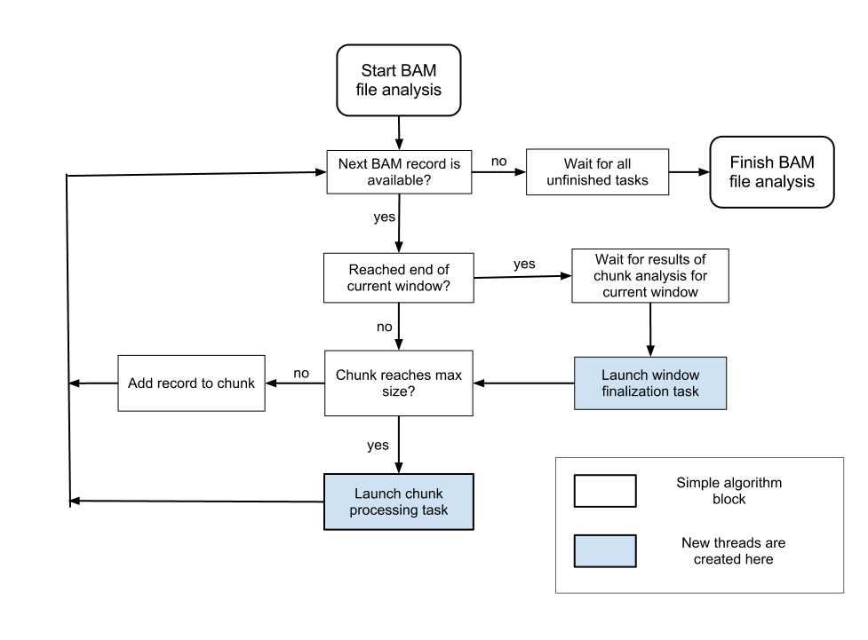

.. _faq:

Frequently Asked Questions
==========================

General
-------

.. _heapsize:

**Q**: *How to increase maximum Java heap memory size?*

**A**: Open the Qualimap launching script in any text editor. Find the following lines: 

    java_options="-Xms32m -Xmx1G -XX:MaxPermSize=1024m"

Set the -Xmx parameter as desired parameter.

Also you can override this parameter by setting environment variable $JAVA_OPTS.

|

**Q**: *Does Qualimap run on MS Windows?*

**A**: Qualimap can be launched on Windows using script :file:`qualimap.bat`. However, officially we do not support MS Windows.   

|

**Q**: *I always get a message "Out of Memory". What should I do?*

**A**: You can try decreasing the number of reads in chunk or increasing :ref:`maximum Java heap memory size <heapsize>`.  

|

Performance
-----------

**Q**: *Does Qualimap make use of multicore systems to improve computation speed?*

**A**: Yes, Qualimap uses threads to perform BAM QC analysis.

In short, reads are processed in chunks and each chunk is analyzed in parallel.

Below you can find a schema, depicting the applied algorithm.

Here each block denotes a certain algorithm step. Analysis starts with dividing reference genome into windows. The first window is set to be the current. Then analysis continues with processing BAM records belonging to current window.

When all reads belonging to current window (region of genome) are processed, the window is finalized. This task is also performed in a separate thread. 

Analysis is finished when all windows are processed.

|

**Q**: *I have a powerful computer with a lot of memory. Can I make Qualimap run faster?*

**A**: Sure, just increase your :ref:`maximum JAVA heap size <heapsize>`. 

|

