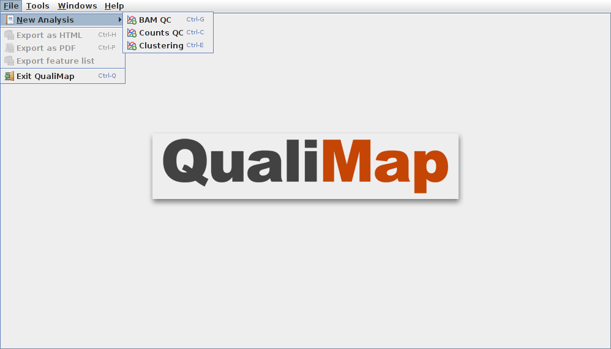
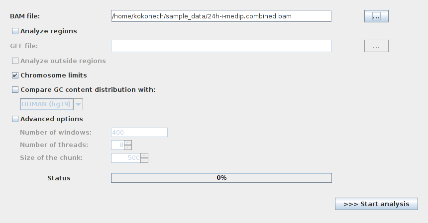

.. _workflow:

Workflow
========

Starting a new analysis
-----------------------

To start new analysis activate main menu item :menuselection:`File --> New Analysis` and select the desired type of analysis. Read more about different types of analysis in :ref:`next chapter <analysis-types>`.  

After the corresponding item is selected a dialog will appear that allows customizing  analysis options ( input  files, algorithm parameters, etc). 

To run the analysis click :guilabel:`Start analysis` button. 

During the computation a status message and a graphic bar will indicate the progress of the computation. 

Viewing the results of the analysis
-----------------------------------

After the selected analysis is finished the results are shown as an interactive report in the Qualimap main window. Several reports can be opened at the same time in different tabs. 

In the left part of the report window one can find a list containing available result items. Clicking an item will automatically show the corresponding information block or graph. Some report items are common for different types of analysis. 

For example, :guilabel:`Summary` section provides a short summary of performed quality control checks, while :guilabel:`Input` section lists all input parameters. To learn more about items specific to various types of anaylsis read :ref:`corresponding section<analysis-types>`. 

Exporting results
-----------------

The resulting report can be saved to HTML page or PDF document.

To export results to HTML use a main menu item :menuselection:`File --> Export to HTML`. In the appeared window one can select the path to the output folder. After clicking :guilabel:`OK` button the web-page, containing analysis results will be saved to specified directory.

Similarly one can save the report to a PDF document by using a main menu item :menuselection:`File --> Export to PDF`.

Using tools
-----------

Qualimap provides also additional functionality other than quality control checks. The :guilabel:`Tools` main menu item allows to access this functionality. Currently there is only one tool available -- :ref:`Compute Counts <compute-counts>`.

In future we plan to add more tools.
